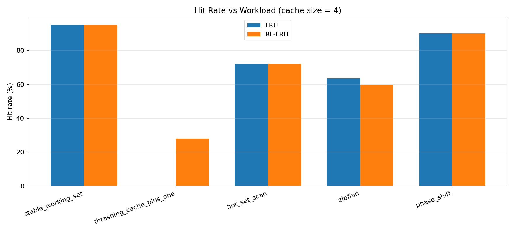
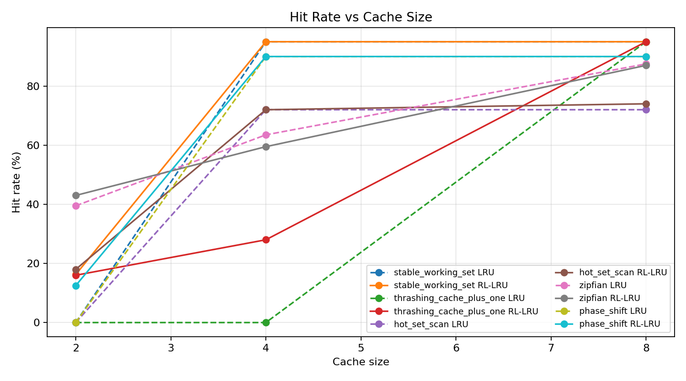
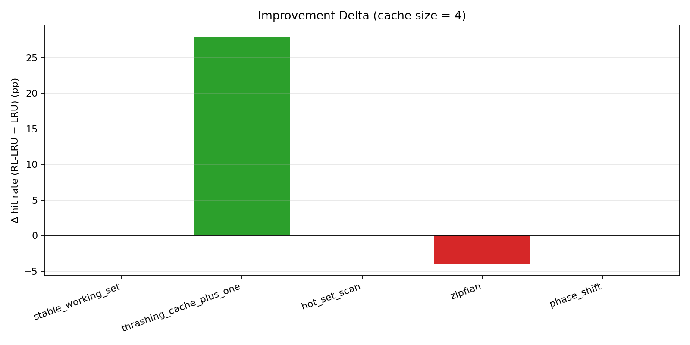

# Implementation of Reinforcement Learning Enhanced LRU Cache Replacement Policy

---

# Motivation
The cache replacement problem aims to maximize hit rates within a constrained memory size.

**Limitations of Traditional LRU:**
- Highly vulnerable to cache pollution (e.g., table scans).
- Exhibits 0% hit rate in thrashing workloads.
- Cannot dynamically adapt to shifting access patterns.

---

# Objective
**Goal:** Add a Reinforcement Learning (RL) layer on top of LRU.

- Learn the optimal eviction strategy per workload.
- Dynamically decide between evicting the LRU candidate or giving it a "second chance."

---

# Implementation Architecture

**Flow:**
Cache Request $\rightarrow$ LRU Candidate Selection $\rightarrow$ RL Agent $\rightarrow$ EVICT/KEEP Decision

**Core Components:**
- **Cache Simulator:** Tracks state transitions and maintains associativity.
- **LRU Policy:** The baseline metric and fallback strategy.
- **Q-Learning Agent:** Evaluates candidate states and decides the optimal action.

---

# LRU vs RL-LRU Comparison

**Standard LRU:**
- Directly evicts the least recently used block.
- Rigid and inflexible to changing workload patterns.

**RL-LRU:**
- LRU selects the candidate for eviction.
- RL decides the eviction action based on learned patterns (`EVICT` or `KEEP`).

---

# Markov Decision Process (MDP) Basics
Before formulating our RL approach, we define the environment as an MDP.

**Core Elements:**
- **State ($S$):** The current situation or context of the environment.
- **Action ($A$):** The choices available to the agent.
- **Reward ($R$):** The feedback signal indicating success or failure.
- **Policy ($\pi$):** The strategy the agent uses to map states to actions.

The agent's goal is to learn a policy that maximizes cumulative future rewards.

---

# RL Formulation
We framed the cache eviction decision as a Markov Decision Process (MDP).

**State Space:** `(frequency_bucket, recent_hit)`
- Compact representation of the LRU candidate block.
- Prevents state-space explosion.

**Action Space:**
- `EVICT`: Standard LRU eviction.
- `KEEP`: Second-chance protection (move to MRU, evict next-oldest).

---

# Q-Learning Implementation Details
Our RL agent utilizes Tabular Q-Learning to learn the optimal policy.

- **Q-Table:** A dictionary mapping the `(frequency, recent_hit)` state to expected future rewards for both `EVICT` and `KEEP` actions.
- **$\epsilon$-Greedy Strategy:** Balances exploration (randomly choosing an action) and exploitation (choosing the action with the highest Q-value).
- **Q-Value Update Rule:** Uses the Temporal Difference (TD) Bellman equation to iteratively update expected values based on delayed rewards.

---

# The Reward Problem

**Issue:** Immediate reward assignment can incorrectly train the agent.

- **Example:**
  1. The agent evicts block `A`.
  2. The next access is block `B` (which is a hit or miss, but not `A`).
  3. The agent immediately gets a `+1` reward for evicting `A`.
  4. Shortly after, block `A` is requested and results in a miss.

The agent was rewarded despite causing a future miss!

---

# Proposed Improvement: Ghost Cache

**Solution:** Replace the single eviction history with a bounded history queue.

**Mechanism:**
- Stores: `Block`, `State`, and `Action`.
- Delays reward based on future reuse:
  - **Reused block $\rightarrow$ Penalty (-1):** The block was requested while still in the ghost cache (a "near miss").
  - **Expired block $\rightarrow$ Reward (+1):** The block fell out of the ghost cache without being requested (a good eviction).

---

# Evaluation Section: Workloads

We evaluated the system using five distinct workload dimensions:

| Workload | Purpose |
|----------|---------|
| Stable Working Set | Baseline |
| Cache+1 Loop | LRU weakness |
| Hot Set + Scan | Pollution resistance |
| Zipfian | Popularity skew |
| Phase Shift | Adaptability |

---

# Evaluation Results (Cache Size: 4)

| Workload | LRU Hit Rate | RL-LRU Hit Rate | $\Delta$ Hit Rate |
|----------|--------------|-----------------|-------------------|
| Stable Working Set | 95.0% | 95.0% | 0.0% |
| Cache+1 Loop | 0.0% | 26.0% | **+26.0%** |
| Hot Set + Scan | 72.0% | 72.0% | 0.0% |
| Zipfian | 63.5% | 60.5% | -3.0% |
| Phase Shift | 90.0% | 90.0% | 0.0% |

---

# Hit Rate vs Workload

*RL-LRU significantly outperforms LRU on thrashing workloads while maintaining baseline performance on stable working sets.*
*This demonstrates that the agent safely learns when to bypass LRU without causing collateral damage.*

---

# Hit Rate vs Cache Size

*The most dramatic improvements are seen at smaller cache sizes where eviction decisions are highly critical.*
*As cache capacity increases, the margin of improvement narrows as LRU naturally performs better.*

---

# Delta Comparison

*Positive deltas confirm that the second-chance KEEP action successfully breaks strict LRU loops.*
*Slight negative deltas in Zipfian distributions highlight the difficulty of learning from noisy delayed rewards.*

---

# Future Work

1. **State Space Expansion:** Incorporating Reuse Distance approximation.
2. **Real Memory Traces:** Transitioning evaluation to real-world SPEC CPU access traces.
3. **Advanced Paradigms:** Exploring Contextual Bandits or Deep Q-Networks (DQN).
